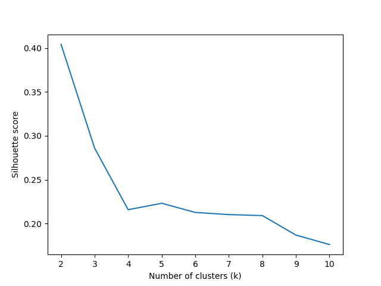
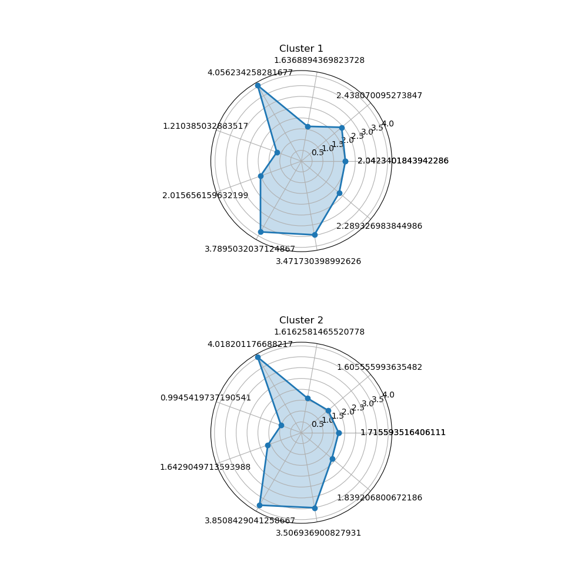

# USTB machine learning course design test-4
## air_data
初始数据集
## test4.py
处理 ```air_data``` 数据集，生成 ```data.csv``` 数据集
## data.csv
处理后的数据集，但是LAST_FLIGHT_DATE并没有进行处理
其中有```2014/2/29 0:00:00```数据是需要处理的
## test4_1.py
处理 ```data.csv``` 数据集，生成 ```data1.csv``` 数据集，实际没什么用
## data1.csv
略
## **test4_2.py**
实际代码部分
运行结果： 
```K best = ```


图片 ```img.png```最终结果

